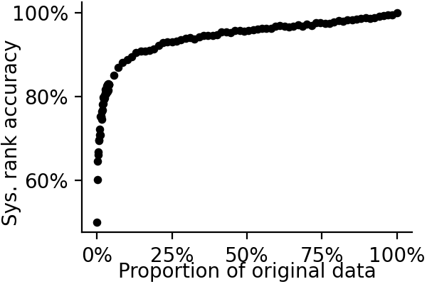
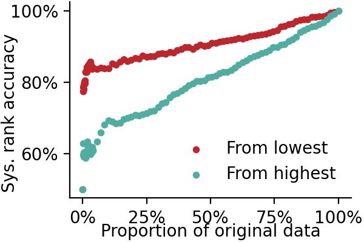
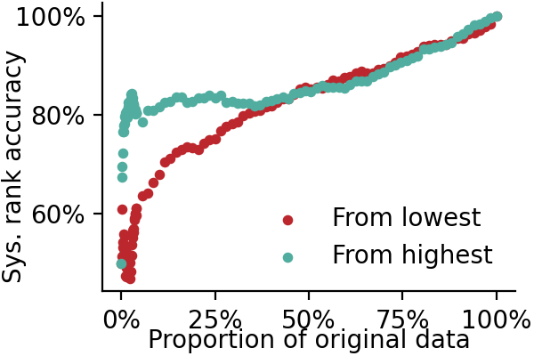
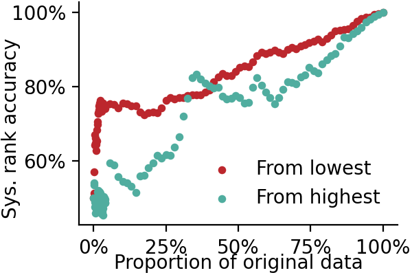

# evaluation-subset-selection

> Active Learning for Evaluation Subset Selection

Randomly taking a subset of the data for human evaluation:

Sorting by absolute metric scores:

Sorting by metric variance:

Sorting by disagreement of two metrics:

