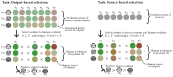

#  subset2evaluate

Package to select informative samples to human-evaluate for NLG tasks such as machine translation or summarization.
It is based on a [paper](https://vilda.net/papers/subset2evaluate.pdf) by Vilém Zouhar, Peng Cui, and Mrinmaya Sachan from ETH Zürich.

> [Selecting Examples to Efficiently Human-Evaluate Models](https://vilda.net/papers/subset2evaluate.pdf): Researchers create test sets to evaluate models with human annotations, which are the gold standard as opposed to automated metrics.
> Natural language generation, a rapidly evolving field, has a recurring need for new test sets.
> Oftentimes, to fit the budgetary constraints, only a random subset of the test set is chosen for evaluation.
> This is grossly inefficient and in this work we provide methods to strategically select the most informative samples to be evaluated.
> We describe variance- and diversity-based methods for when we know the system outputs and their evaluation with automated metrics beforehand.
> These methods consistently outperform random subset selection, the most common approach.
> We introduce PreCOMET to make our methods applicable to blind test sets, where the systems are unknown in advance.
> The model is trained to predict item utility for human evaluation just based on the source alone.
> We show on two natural language generation tasks, machine translation and summarization, that these methods make human evaluation more efficient and reduce costs without burdening annotators.



### General recommendations based on MT evaluation:

| When to use? | What is it? | How to use? |
|-|-|-|
| Good automated metric available, such as `MetricX-23`. | Variance in metric scores. | `method="var", metric="MetricX-23"` |
| Metric not available but system outputs available. | Diversity of system outputs. | `method="diversity"` |
| System outputs not available, only sources. | Estimated diversity in system outputs. | `method="precomet_diversity"` |

## Example for Machine Translation

Install the package and download WMT data:
```bash
pip3 install subset2evaluate
bash experiments/01-get_wmt_data.sh
```

Then in Python we compute the baseline:
```python
import subset2evaluate

data_full = subset2evaluate.utils.load_data("wmt23/en-cs")
len(data_full)
> 1098

# take only top 100 segments to "human-evaluate"
data_new = subset2evaluate.select_subset.run_select_subset(data_full, method="random")
subset2evaluate.utils.eval_system_clusters(data_new[:100])
> 1

# compare it to something better:
data_new = subset2evaluate.select_subset.run_select_subset(data_full, method="var", metric="MetricX-23")
subset2evaluate.utils.eval_system_clusters(data_new[:100])
> 3
```

Benchmarks for some of the methods on WMT23:

<!-- TODO: -->

## Example for Summarization

```python
import subset2evaluate

data_full = subset2evaluate.utils.load_data("summeval")
len(data_full)
> 100

# take only top 25 segments to "human-evaluate"
data_new = subset2evaluate.select_subset.run_select_subset(data_full, method="random")
subset2evaluate.utils.eval_system_clusters(data_new[:25], metric="human_relevance")
> 2

data_new = subset2evaluate.select_subset.run_select_subset(data_full, method="diversity")
subset2evaluate.utils.eval_system_clusters(data_new[:25], metric="human_relevance")
> 3
```

## Example for Custom Dataset

The intended usage is for your own custom datasets where you wish to choose which to evaluate.
The input to subset2evaluate needs to be a list of items.
What each item needs to contain depends on the method.
For example, `diversity` requires `tgt` on each item such that the output diversity can be computed.
As another texample `var` requires `scores/metric` on each item such that the metric variance can be computed.
The item can contain any additional extra fields even if they're not explicitly used.
As an example, look at the existing loaders:

```python
import subset2evaluate
import json
data = subset2evaluate.utils.load_data("wmt23/en-de")

len(data)
> 549

json.dumps(data[0], indent=2)
> {
>   "i": 0,
>   "src": "Police arrest 15 after violent protest outside UK refugee hotel",
>   "ref": "Polizei verhaftet 15 Menschen nach gewalttätigen Protesten vor einer Flüchtlingsunterkunft in Großbritannien",
>   "tgt": {
>     "Lan-BridgeMT": "Polizei verhaftet 15 nach gewalttätigem Protest vor britischem Flüchtlingshotel",
>     "NLLB_MBR_BLEU": "Polizei verhaftet 15 nach gewaltsamen Protesten vor einem britischen Flüchtlingshotel",
>     "ZengHuiMT": "Die Polizei verhaftet 15 Personen nach gewalttätigem Protest vor britischem Flüchtlingshotel.",
>     "ONLINE-A": "Polizei nimmt 15 nach gewalttätigen Protesten vor britischem Flüchtlingshotel fest",
>     "ONLINE-W": "Polizei nimmt 15 Personen nach gewaltsamen Protesten vor einem britischen Flüchtlingshotel fest",
>     "ONLINE-B": "Polizei verhaftet 15 Personen nach gewalttätigem Protest vor britischem Flüchtlingshotel",
>     "NLLB_Greedy": "Polizei verhaftet 15 nach gewalttätigen Protesten vor einem Flüchtlingshotel in Großbritannien",
>     "ONLINE-M": "Polizei verhaftet 15 nach gewalttätigem Protest vor britischem Flüchtlingshotel",
>     "AIRC": "Polizeiverhaftung 15 nach gewaltsamen Protesten außerhalb des britischen Flüchtlingshotels",
>     "ONLINE-Y": "Die Polizei verhaftet 15 Personen nach gewaltsamen Protesten vor einem britischen Flüchtlingshotel",
>     "GPT4-5shot": "Die Polizei nimmt 15 Personen nach gewalttätigen Protesten vor einem britischen Flüchtlingshotel fest.",
>     "ONLINE-G": "Polizei verhaftet 15 nach gewalttätigem Protest vor britischem Flüchtlingshotel"
>   },
>   "time": 0.2119810263850096,
>   "domain": "news",
>   "doc": "aj-english.33941",
>   "scores": {
>     "Lan-BridgeMT": {
>       "human": 0.9175257731958762,
>       "XCOMET-XL": 0.9867596612701105,
>       "f200spBLEU": 0.2759278681802151,
>       ...
>     },
>     "GPT4-5shot": {
>       "human": 0.9948453608247423,
>       "XCOMET-XL": 0.988012809964431,
>       "f200spBLEU": 0.3275118410766353,
>       ...
>     },
>     "ONLINE-G": {
>       "human": 0.8762886597938144,
>       "XCOMET-XL": 0.9867596612701105,
>       "f200spBLEU": 0.2759278681802151,
>       ...
>     }
>   }
> }

```

```
import utils
data = utils.load_data_wmt()

# In most cases we want to normalize the data such that values are in [0, 1]
data = utils.load_data_wmt(normalize=True)

# There are other options that load a different language pair from a different year but the default should be fine for now
# The `data` is a list of items
# Each item has:
# - `i` - the index of the item
# - `domain` - the domain of the sentence
# - `src` - the source sentence
# - `ref` - the reference sentence
# - `tgt` - mapping from systems to their translations
# - `scores` - mapping from systems to score names to numbers
#            - for example data[0]["scores"]["ONLINE-Y"]["human"] is the human judgement for ONLINE-Y system for the first item
#            - for example data[5]["scores"]["NLLB_GReedy"]["MetricX-23"] is MetricX-23 score for NLLB_GReedy system for the sixth item
```

## Command-line Interface

We recommend using the Python interface but the package can also be used from the command line:

```
subset2evaluate wmt23/en-cs --method var --args "{'metric': 'MetricX-23'}" > wmt23_encs_sorted.jsonl
subset2evaluate-eval wmt23/en-cs wmt23_encs_sorted.jsonl 
> Clusters: 2.30
> Accuracy: 86.7%
```

## Contact & Contributions

We are look forward to contributions, especially (1) using subset2evaluate for other tasks, (2) adding new methods, (3) finding bugs and increasing package usability.
Please file a GitHub issue or [send us an email](mailto:vilem.zouhar@gmail.com).